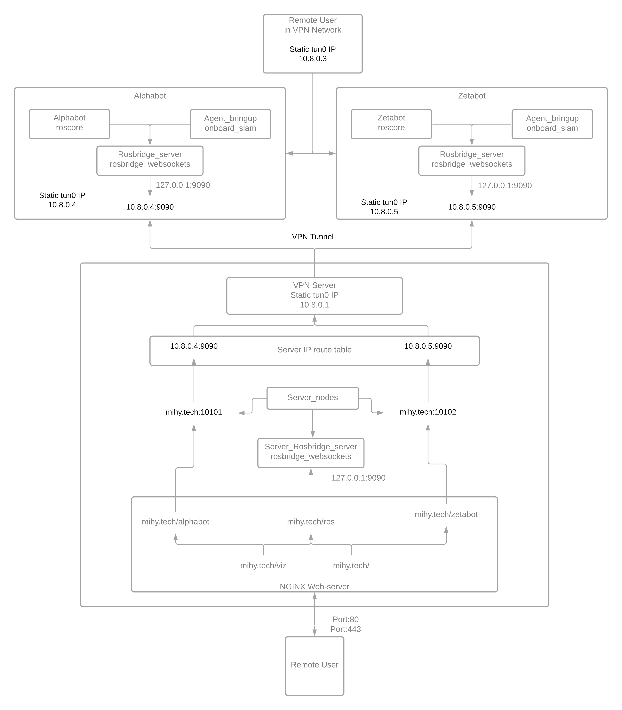
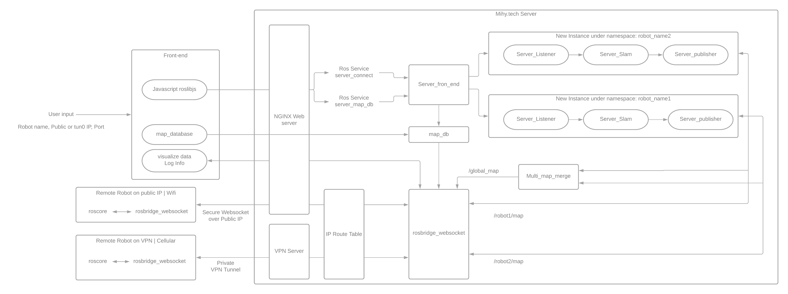

# 4G-Networked_Robots
## Overview
The goal of this project was to develop a cloud infrastructure where remote robots whether on wifi or cellular, can connect, store and share information as well as perform computationally intensive tasks offboard, i.e. on the server.

I used turtlebots with Sim/GPS modules for testing and development. The robots would connect to the server via web sockets. The server subscribes to the robot's messages and performs SLam online. A local, as well as a global map, is streamed back to the remote robots. When disconnected from the server, a copy of the map is saved in the server's map database, sorted by their GPS location. A front-end website (hosted on the server) helps the user to connect their robot to the network, control it, visualize live maps as well as access map databases. 

Please check my live project website [mihy.tech](http://mihy.tech/) and details of my implementation in my [portfolio_post](http://www.whomihirpatel.com/). Below are the instructions for using this package to deploy your own server.

## Package Description
This repository consists of several packages as listed below:
Packages | Description
------------ | -------------
[agent_bringup](https://github.com/whomihirpatel/4G-Networked_Robots/tree/master/agent_bringup)| ROS package which helps robot to connect to the server. This package is to be deloyed on turtlebot.
[server_listener](https://github.com/whomihirpatel/4G-Networked_Robots/tree/master/server_listener) | ROS package used for connecting to remote robots, subscribe to desired topics as 'json' message and republish it as ros message under `/robot_name/topic` on the server.
[server_slam](https://github.com/whomihirpatel/4G-Networked_Robots/tree/master/server_slam) | ROS package used to perform slam offboard i.e. on the server
[server_publisher](https://github.com/whomihirpatel/4G-Networked_Robots/tree/master/server_publisher) | ROS package that uses `server_slam` and `server_listener` package and completes entire workflow pipeline to fetch, compute and publish data back to the robot.
[website_front_end](https://github.com/whomihirpatel/4G-Networked_Robots/tree/master/website_front_end) | This folder contains website files which help user to connect their robot to the server
[nginx_scripts](https://github.com/whomihirpatel/4G-Networked_Robots/tree/master/nginx_scripts) | This folder contains NGINX scripts I wrote for my server. It can be used as a tempelate.
[cellular_resources](https://github.com/whomihirpatel/4G-Networked_Robots/tree/master/cellular_resources) | Some helpful resources for robots on cellular network.


## Submodule Dependencies
Title | Link
------------ | -------------
m-explore | [Github](https://github.com/hrnr/m-explore)
webviz | [Github](https://github.com/cruise-automation/webviz)

## Server Deployment Instructions

You may use any cloud platform like [DigitalOcean](https://www.digitalocean.com/), [AWS EC2](https://aws.amazon.com/ec2/), [GCP](https://cloud.google.com/), [Azure](https://azure.microsoft.com/en-us/) or even a home server to deploy this bundle.

1. Package Installation:
* Create a catkin workspace
    ```
    mkdir -p ~/catkin_ws/src
    cd ~/catkin_ws/src/
    ```
* Clone the repo into `catkin_ws/src`
    ```
    git clone https://github.com/whomihirpatel/4G-Networked_Robots.git
    cd 4G-Networked_Robots
    git submodule update --init
    ```
    - Install other required packages using 
    ```
    pip install -r requirements.txt
    ```
    - Installation instructions for [webviz](https://webviz.io/) can be found [here](https://github.com/cruise-automation/webviz)
    - Easiest way to deploy webviz is through webviz Docker image.
    ```
    docker run -p 'port':'port' cruise/webviz
    ```
    
* Build the workspace and activate it
    ```
    cd ~/catkin_ws/
    catkin_make
    source ~/catkin_ws/devel/setup.zsh
    ```
2. Web Hosting:
- Installation instructions for NGINX web server can be hound [here](https://www.digitalocean.com/community/tutorials/how-to-install-nginx-on-ubuntu-20-04)
- [nginx_scripts](https://github.com/whomihirpatel/4G-Networked_Robots/tree/master/nginx_scripts) folder configuration files which can be used as a tempelate. 
- Detailed Instructions on front-end hosting, database listing and routing VPN traffic are given in the [nginx_scripts](https://github.com/whomihirpatel/4G-Networked_Robots/tree/master/nginx_scripts) folder.

3. VPN Hosting:
- Installation instructions for VPN Server can be hound [here](https://www.digitalocean.com/community/tutorials/how-to-set-up-and-configure-an-openvpn-server-on-ubuntu-20-04) and [here](https://openvpn.net/community-resources/how-to/)
- Make sure to generate a unique client certificate for each robot and assign a static tun0 IP for each client.
- update the `server.conf` to allow inter-client communication and allow static IP assignment by adding following lines:
    ```
    ifconfig-pool-persist ipp.txt
    client-to-client
    push "route 192.168.4.0 255.255.255.0"
    ```
4. Front-end
- A front-end minimal website is developed. It can be used to connect robots to server, visualize data, check log and see server_database.
- Further instructions on front-end is given in [website_front_end](https://github.com/whomihirpatel/4G-Networked_Robots/tree/master/website_front_end) folder.
- Some html snippets are taken from [codepen](https://codepen.io/rkpasia/pen/LNEQod)

## Connecting Robots to the server

- If you are using robots connected to wifi and can allow incoming web-socket traffic to your robot, you may skip to next step
- If you are using robots conencted to cellular network or have incoming traffic blocked on your wifi, you may to connect to the server via VPN tunnel and route the traffic on the server.
    - Generate a unique CA certificate for your robot. Detailed instructions [here](https://www.digitalocean.com/community/tutorials/how-to-set-up-and-configure-a-certificate-authority-ca-on-ubuntu-20-04)
    - edit the ipp.txt file in openvpn directory and add name of your CA authority (i.e. name you used in unique CA certificate), followed by desired/available static ip.
    ```
    sample,10.8.0.4,fddd:1194:1194:1194::1001
    ```
    - Route the VPN traffic from server port to VPN device port using command
    ```
    sudo iptables -t nat -A PREROUTING -p tcp --dport 10101 -j DNAT --to-destination 10.8.0.4:9090
    ```
    - Though it is advised to block external ports using `sudo ufw enable` and use NGINX to reverse-proxy all traffic through port 80.
        - In that case front-end will communicate with individual robots via port 80 insted of any other server port.
        - Make a nginx `.conf` file which reverse-proxy the external traffic to localhost. A sample `robot_name.conf` is provided in [nginx_scripts](https://github.com/whomihirpatel/4G-Networked_Robots/tree/master/nginx_scripts) folder.

- Now both, your server and robots are ready!
    
## Usage Instructions
## Server Slam
- To use server for online slam application as shown in the video, simply launch, everything is preconfigured!
```
roslaunch server_publisher publisher.launch front_end_listener:=true local_port:=9090 server_port:=9090
```
- There are multiple roslaunch included in one another, Please check individual packages Readme for their description and usage.

### Client Robot instructions
### Turtlebots
- If you are using a turtlebot, you may use our agent_bringup package on your robot. This package allows you to effortlessly connect your robot to the server.
- Detailed instructions on installation are given in the [agent_bringup](https://github.com/whomihirpatel/4G-Networked_Robots/tree/master/agent_bringup) folder.
### Other Robots
- If you are using any other robot, launch
```
roslaunch rosbridge_server rosbridge_websocket.launch port:=9090 websocket_external_port:=80
```
- You need to publish following topics locally and have `robot_description` loaded in rosparam_server
    - `tf`
    - `tf_static`
    - `scan`
    - `joint_states`
## Other Application
- If you want to use server for other application, you may use server_listener, and server_publisher package along with your own package.
- Detailed instructions on using [server_listener](https://github.com/whomihirpatel/4G-Networked_Robots/tree/master/server_listener) and [server_publisher](https://github.com/whomihirpatel/4G-Networked_Robots/tree/master/server_publisher) package are given in their respective folders

## Network Architecture

## Server workflow


## Future Work:

- I am currently working on improving the global map and using a map database to create a merged map for different GPS grids when enough maps are collected.

- Server_slam and serve map database is a demonstration of offboard computation, data storage, and sharing. But this package can be used to deploy any cloud-based networked robotic system for any offboard computation task, create a shared cloud database and securely connect remote robots whether they are on wifi or cellular!