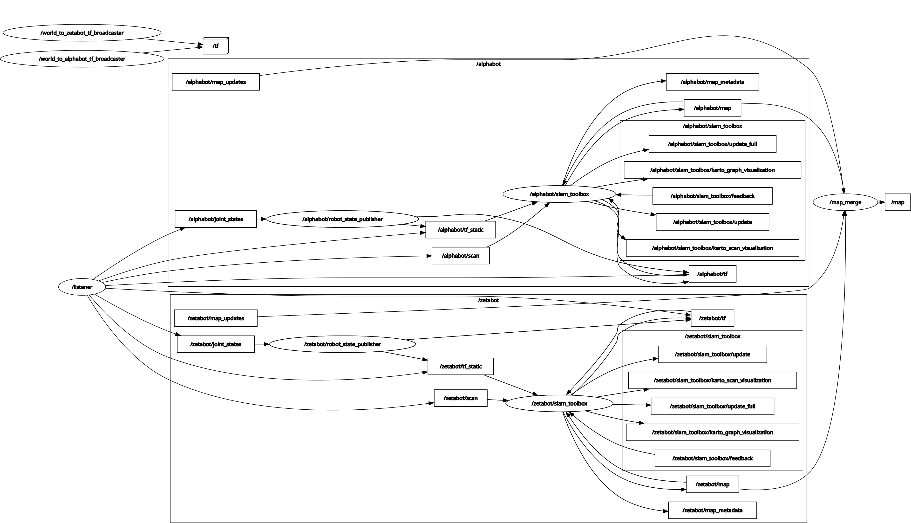
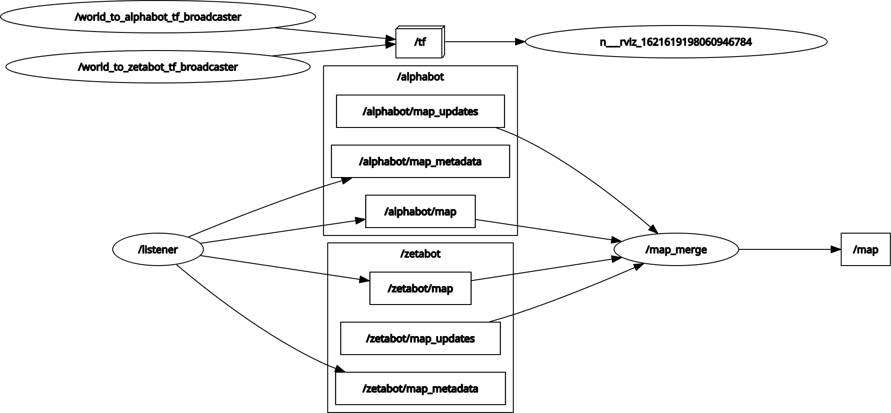

# Server Slam Package

## Overview
This package is used to perform slam offboard i.e. on the server

### Nodes List
Node | Description
------------ | -------------
front_end_service| provides services which launch server_listener, server_slam and server_publisher instance under a robot namespace and service which saves map on the server database based on GPS location

## Launch file usage Instructions

- `server_slam.launch` is launches slam_toolbox nodes and server listener under a robot namespace. 
- It uses `server_listener` to subscribe  to remote robot's `tf`, tf_static, `joint_states`, and `scan` data. TF are prefixed under `robot_name`.
- Using remote robot's `robot_description` fetched by `server_listener` package, `server_slam` launches local `robot_state_publisher` under `robot_name` namespace.

    ```
    roslaunch server_slam server_slam.launch robot_name:=zetabot ip:=mihy.tech port:=10402 
    ```

    ## `server_slam.launch` configuration options:

    Args | Default | Description
    ------------ | ------------- | -------------
    `robot_name:=zetabot`|**required**| Name of the robot (received from front-end)
    `ip:=mihy.tech` |**required**|  IP of the robot (received from front-end)
    `port:=10402` |**required**|  Port of the robot (received from front-end)

- Optionally if user wish to perform slam onboard (i.e. on the robot not on the server), `onboard_slam.launch` launch file is used instead of `server_slam.launch`. It uses `server_listener` to subscribe to remote robot's `map` topic only.
    ```
    roslaunch server_slam onboard_slam.launch robot_name:=zetabot ip:=mihy.tech port:=10402 
    ```

    ## `onboard_slam.launch` configuration options:

    Args | Default | Description
    ------------ | ------------- | -------------
    `robot_name:=zetabot`|**required**| Name of the robot (received from front-end)
    `ip:=mihy.tech` |**required**|  IP of the robot (received from front-end)
    `port:=10402` |**required**|  Port of the robot (received from front-end)

- `map_merge.launch` is launches 3rd party package `multirobot_map_merge`'s `map_merge` node to publish a global map `/map` 
    ```
    roslaunch server_slam map_merge.launch
    ```

## External Package Dependencies
Title | Link
------------ | -------------
slam_toolbox| [Github](https://github.com/SteveMacenski/slam_toolbox)
m-explore | [Github](https://github.com/hrnr/m-explore)

## Rqt (to be updated!)
Below is a representation of rqt when slam is performed online:


Below is a representation of rqt when slam is performed onboard:


